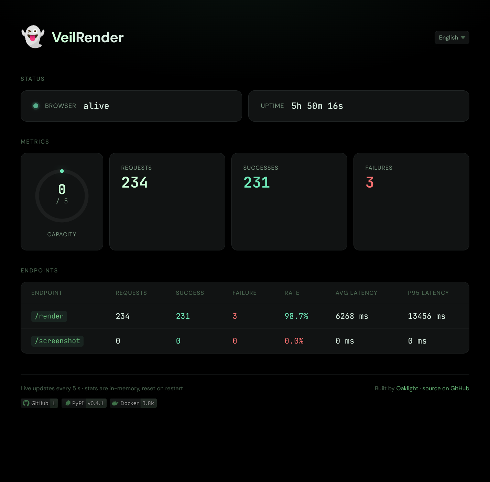

# VeilRender

[](https://pypi.org/project/veilrender/)
[](https://github.com/Oaklight/veilrender/releases/latest)
[](https://github.com/Oaklight/veilrender/actions/workflows/ci.yml)
[](https://hub.docker.com/r/oaklight/veilrender)
[](https://opensource.org/licenses/MIT)

[中文](README_zh.md) | **English**

Headless browser rendering API with stealth capabilities — self-hostable via Docker or pip.

VeilRender accepts a URL and returns the fully rendered page content (HTML, Markdown, readability-extracted article) using a stealth Chromium browser. Designed as a fallback for fetch tools that fail on JavaScript-rendered or bot-protected pages.



## Features

- **Stealth rendering** — [CloakBrowser](https://github.com/CloakHQ/CloakBrowser) (71 C++ fingerprint patches) + [Patchright](https://github.com/AhmedKhaledp-0/patchright-python) (stealth Playwright fork)
- **Multiple output formats** — raw HTML, Markdown, readability-extracted article text
- **Screenshot capture** — full-page or viewport PNG
- **Horizontal scaling** — gateway + remote browser worker pool with health checks and auto-reconnection
- **Mixed browser backends** — Chromium (CDP) and Firefox/Camoufox (Playwright protocol) in the same pool
- **Prometheus metrics** — `/metrics` endpoint with latency percentiles, per-worker gauges
- **Dashboard** — live stats at `/` with i18n (en/zh), SVG capacity gauge
- **Ad/tracker blocking** — 82k domain blocklist from [StevenBlack/hosts](https://github.com/StevenBlack/hosts)
- **Render cache** — L1 in-memory + L2 S3-compatible (R2, Oracle, AWS)
- **CDP proxy** — direct WebSocket access to the browser at `/cdp`
- **Zero external deps** (except `patchright`) — HTTP server, S3 client, HTML parsing all vendored

## Quick Start

### Docker (recommended)

```bash
# Single instance with embedded CloakBrowser
docker run -p 7860:7860 -e VEILRENDER_API_TOKEN=your-secret oaklight/veilrender:latest

# Gateway only (no browser, 336MB)
docker run -p 7860:7860 oaklight/veilrender:gateway
```

### pip

```bash
pip install veilrender
veilrender  # starts on :7860, auto-downloads CloakBrowser binary on first run
```

### Docker Compose — Worker Pool

```yaml
# docker-compose.yaml
services:
  veilrender:
    image: oaklight/veilrender:gateway
    ports: ["7860:7860"]
    environment:
      - VEILRENDER_WORKERS=cdp://browser-worker:9222
  browser-worker:
    image: cloakhq/cloakbrowser
    command: ["cloakserve"]
```

See `deploy/` for more compose examples including mixed Chromium+Camoufox pools.

## API

### GET /health

```json
{"status": "ok"}
```

### POST /render

Render a URL and return the page content.

```bash
curl -X POST http://localhost:7860/render \
  -H "Authorization: Bearer your-secret" \
  -H "Content-Type: application/json" \
  -d '{"url": "https://example.com", "formats": ["html", "readability", "markdown"]}'
```

Request body:

| Field | Type | Default | Description |
|-------|------|---------|-------------|
| `url` | string | *(required)* | URL to render |
| `formats` | string[] | `["html"]` | Output formats: `html`, `readability`, `markdown` |
| `wait_until` | string | `"load"` | Playwright wait strategy: `load`, `domcontentloaded`, `networkidle` |

### POST /screenshot

Capture a PNG screenshot.

```bash
curl -X POST http://localhost:7860/screenshot \
  -H "Authorization: Bearer your-secret" \
  -H "Content-Type: application/json" \
  -d '{"url": "https://example.com"}' -o screenshot.png
```

### GET /metrics

Prometheus exposition format with uptime, request counters, cache stats, latency summaries (p50/p95), and per-worker health gauges.

### GET /stats

JSON API for live dashboard data (polled by the dashboard UI).

### WS /cdp

Direct CDP WebSocket proxy to the browser. Supports `?worker=N` for targeting specific workers in a pool.

## Configuration

All settings via `VEILRENDER_*` environment variables:

### Core

| Variable | Default | Description |
|----------|---------|-------------|
| `VEILRENDER_API_TOKEN` | *(none)* | Bearer token. If unset, auth is disabled |
| `VEILRENDER_PORT` | `7860` | Server port |
| `VEILRENDER_HOST` | `0.0.0.0` | Bind address |
| `VEILRENDER_TIMEOUT` | `30000` | Page load timeout (ms) |
| `VEILRENDER_VIEWPORT_WIDTH` | `1280` | Browser viewport width |
| `VEILRENDER_VIEWPORT_HEIGHT` | `720` | Browser viewport height |
| `VEILRENDER_MAX_CONCURRENT` | `5` | Max concurrent pages (single-instance) |

### Worker Pool

| Variable | Default | Description |
|----------|---------|-------------|
| `VEILRENDER_WORKERS` | *(none)* | Comma-separated worker endpoints (enables pool mode) |
| `VEILRENDER_WORKER_MAX_CONCURRENT` | `5` | Per-worker page concurrency |
| `VEILRENDER_WORKER_HEALTH_INTERVAL` | `10` | Health check interval (seconds) |

Worker endpoint formats:
- `cdp://host:9222` or `http://host:9222` — Chromium CDP worker
- `playwright://host:1234/ws-path` — Firefox/Camoufox Playwright worker
- `playwrights://host:1234/ws-path` — TLS Playwright worker

### Browser Binary

| Variable | Default | Description |
|----------|---------|-------------|
| `CLOAKBROWSER_BINARY` | *(auto)* | Path to custom browser binary |
| `CLOAKBROWSER_MIRROR` | *(none)* | GitHub mirror URL for China (e.g. `https://ghfast.top`) |

Binary detection cascade: env var → `~/.cloakbrowser/*/chrome` → auto-download from GitHub Releases.

### Cache & Storage

| Variable | Default | Description |
|----------|---------|-------------|
| `VEILRENDER_CACHE_ENABLED` | `false` | Enable render caching |
| `VEILRENDER_CACHE_TTL` | `86400` | Cache TTL in seconds |
| `VEILRENDER_RESOURCE_FILTER` | `true` | Block ads/trackers during rendering |
| `VEILRENDER_S3_ENDPOINT` | *(none)* | S3 endpoint for L2 cache |
| `VEILRENDER_S3_ACCESS_KEY` | *(none)* | S3 access key |
| `VEILRENDER_S3_SECRET_KEY` | *(none)* | S3 secret key |

## Deployment Modes

### Single Instance (full image, 1.07GB)

Embedded CloakBrowser — simplest setup, no external dependencies.

```bash
docker run -p 7860:7860 -e VEILRENDER_API_TOKEN=secret oaklight/veilrender:latest
```

### Gateway + Worker Pool (gateway image, 336MB)

Browser containers scale independently. Gateway routes via least-connections.

```yaml
services:
  veilrender:
    image: oaklight/veilrender:gateway
    environment:
      - VEILRENDER_WORKERS=cdp://worker1:9222,cdp://worker2:9222

  worker1:
    image: cloakhq/cloakbrowser
    command: ["cloakserve"]

  worker2:
    image: cloakhq/cloakbrowser
    command: ["cloakserve"]
```

### Mixed Pool (Chromium + Camoufox)

Dual-engine stealth: CloakBrowser for Chromium-fingerprinted sites, Camoufox for Firefox-fingerprinted sites.

```yaml
services:
  veilrender:
    image: oaklight/veilrender:gateway
    environment:
      - VEILRENDER_WORKERS=cdp://chromium:9222,playwright://camoufox:1234/ws

  chromium:
    image: cloakhq/cloakbrowser
    command: ["cloakserve"]

  camoufox:
    build: deploy/Dockerfile.camoufox
```

### Local Browser Gateway (use your own cookies)

Connect the gateway to your desktop browser to render authenticated pages
using your existing login sessions. Start Chromium with CDP enabled:

```bash
chromium --remote-debugging-port=9333
```

Then run the gateway container:

```bash
docker run --rm --network host \
  -e VEILRENDER_PORT=7880 \
  -e VEILRENDER_WORKERS=http://127.0.0.1:9333 \
  oaklight/veilrender:gateway
```

Now `POST /render` to `localhost:7880` renders pages as your logged-in browser
would — including sites behind authentication, Cloudflare challenges, etc.

> **Tip**: Create a desktop shortcut for CDP-enabled Chromium so you can
> launch it from your application menu when needed. See
> [AGENTS.md](AGENTS.md) for details.

> **Note**: Only Chromium-based browsers support CDP. Firefox/Waterfox
> cannot be used this way (they lack the Juggler protocol that Playwright
> requires). For Firefox-based stealth rendering, use Camoufox workers.

## Docker Images

| Tag | Size | Content |
|-----|------|---------|
| `latest` / `0.4.0` | 1.07GB | Full — Patchright + CloakBrowser |
| `gateway` | 336MB | Gateway only — no browser binary |

Build locally:
```bash
make build          # full image
make build-gateway  # gateway image
```

## Development

```bash
# Setup
pip install -e ".[dev]"

# Run locally
make dev            # starts on :7860

# Lint & type check
make lint           # ruff check --fix && ruff format
make typecheck      # ty check

# Dev deploy
make deploy-dev SSH_TARGET=oaklight.buttercup
```

## License

MIT
